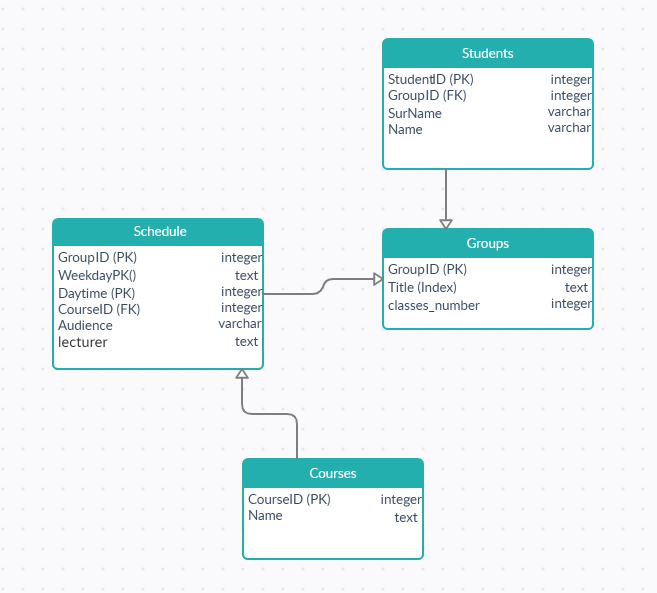

# Лабораторная работа 2 и 3. 
Программа представляет из себя систему для хранения и просмотра информации о студентах, курсах, группах. Программа предоставляет доступ к расписанию для конкретного студента. Также реализован функционал добавления новых записей, изменение любой из таблиц, удаление данных, очистка таблиц.
## Критерии к БД 3:
1. Все таблицы в 3НФ потому что...
    1) 1НФ Для каждой таблицы отдельное значение кортежа содержит только одно, несоставное значение. Нет повторений строк в таблице.
    
    2) 2НФ
        
        1. Для таблицы Students все значения - имя, фамилия, номер группы неприводимо зависят только от айди студента (например имя и фамилия не зависят от группы).
        2. Для Courses - аналогично для названия курса.
        3. Groups - аналогично с названием, но количество занятий дял группы так же зависит только от её айди.
        4. В таблице Schedule имеется составной ключ. День недели, время пары и айди группы точно определяют занятие. Не может быть другого занятия в то же время и для той же               группы. Лектор, курс и аудитория целиком зависят от этого первичного ключа. Например: лектор может преподавать в разных аудиториях и разные курсы, но что-то конкретное           он преподает конкретнйо группе в опредленное время и в опредленной аудитории.
      
    3) 3НФ
        1. Для таблицы Students: имя и фамилия никак не зависят от группы студента.
        2. Для Courses - здесь только название кроме айди.
        3. Groups - аналогично, если учесть что существует однозначная зависимоть между айди и название группы.
         4. В таблице Schedule все можно опять же показать на примере из прошлого пункта. Нельзя вынести в отдельные таблица никакие поля (курс, аудитория, лектор), т.к. они могут           меняться, но остаются независимы друг от друга.

2. Количество таблиц – 4;

3. Подключение к БД выполняется выделенным пользователем

4. Индекс создан по текстовым полям name, surname в таблице Students

5. Поле classes_number в Groups. Поле показывает сколько пар в неделю для данной группы. При добавлении/изменении инкрементируем поле, при удалении/изменении декрементируем.

## Функционал в GUI:

1. Создание базы данных. Удаление базы данных

2. Вывод содержимого любой из таблиц.

3. Очистка одной или всех таблиц.

4. Добавление новых данных

5. Поиск по индексу на name, surname в  Schedule (Вывод расписание для конкретного студента)

6. Обновление кортежа

7. Удаление по индексу на name, surname из таблицы Students

**Все функции для работы с базой данных реализованы как хранимые plpgsql функции.**
